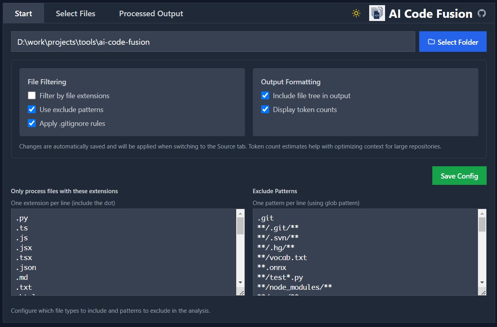
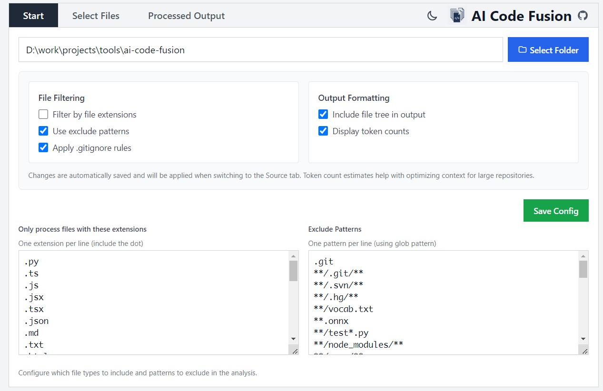
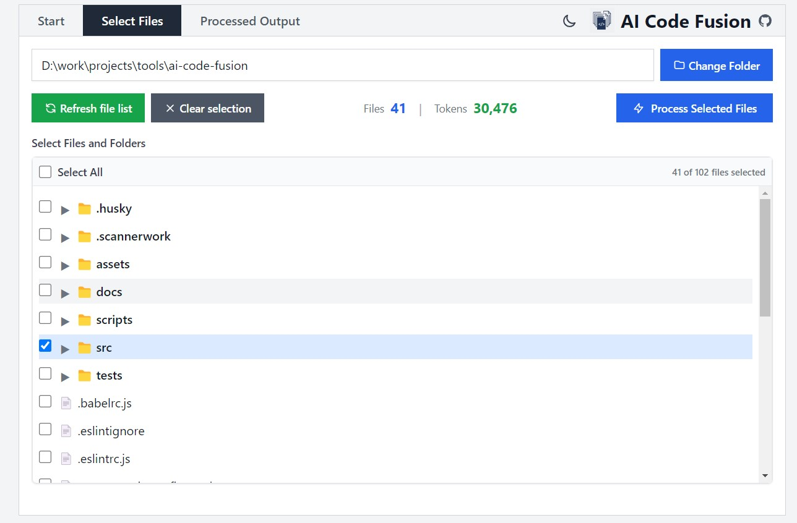
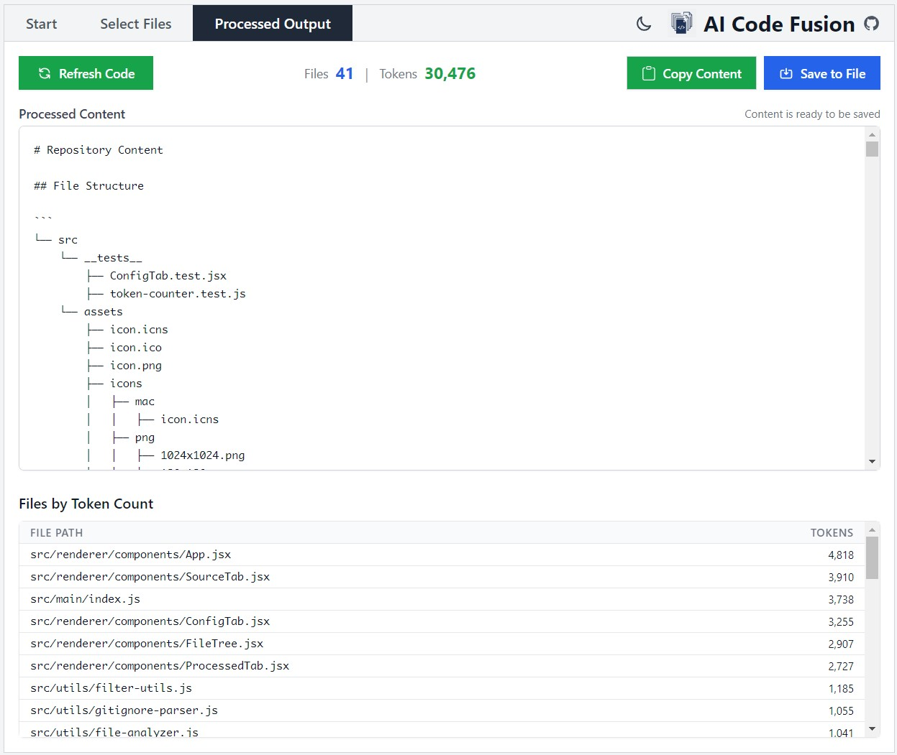

# AI Code Fusion

## Features

A desktop application for preparing and optimizing code repositories for AI processing and analysis. It helps you select specific files, count tokens, and process source code for AI systems.

- Visual directory explorer for selecting code files
- Advanced file filtering with customizable patterns
- Accurate token counting for various AI models
- Code content processing with statistics
- Cross-platform support (Windows, macOS, Linux)

## Installation

### Download

Download the latest version for your platform from the [Releases page](https://github.com/user/repo/releases).

### Windows

1. Download the `.exe` installer
2. Run the installer and follow the instructions
3. Launch from the Start Menu or desktop shortcut

### macOS

1. Download the `.dmg` file
2. Open the DMG and drag the application to your Applications folder
3. Launch from Applications

### Linux

1. Download the `.AppImage` file
2. Make it executable: `chmod +x AI.Code.Prep-*.AppImage`
3. Run it: `./AI.Code.Prep-*.AppImage`

## Usage Guide

### 1. Configuration

Configure file filtering to include or exclude specific file types and patterns.



- Set file extensions to include (e.g., `.js`, `.py`, `.cpp`)
- Define patterns to exclude (e.g., `node_modules`, `.git`, `build`)
- Choose your token counting model based on your target AI system

### 2. File Selection

Select files and directories to analyze and process.



- Browse and select your root project directory
- Use the tree view to select specific files or folders
- See file counts and sizes in real-time

### 3. Token Analysis

Get accurate token estimations before processing.



- View token counts per file and total
- See character and line counts
- Get estimations for different AI models

### 4. Final Processing

Generate the processed output ready for use with AI systems.



- Get the final processed content
- Copy directly to clipboard
- Export to file if needed

## Building from Source

### Prerequisites

- Node.js (v14 or later)
- npm
- Git

### Setup

```bash
# Clone the repository
git clone https://github.com/user/repo.git
cd repo

# Install dependencies
make setup
# or
npm install
```

### Development

```bash
# Start the development server
make dev
# or
npm run dev
```

#### Troubleshooting Development

If you encounter issues with the development server:

1. For Windows users: The `make.bat` file has special handling for the `dev` command that properly sets environment variables
2. If you're still having issues:
   - Ensure all dependencies are installed: `npm install`
   - Try rebuilding: `npm run rebuild`
   - Close any running instances of the app
   - Restart your terminal/command prompt
   - As a last resort, try direct electron launch: `npm run dev:direct`

### Building

```bash
# Build for current platform
make build

# Build for specific platforms
make build-win    # Windows
make build-linux  # Linux
make build-mac    # macOS (Intel)
make build-mac-arm  # macOS (Apple Silicon)
make build-mac-universal  # macOS (Universal)
```

## License

GPL 3.0
