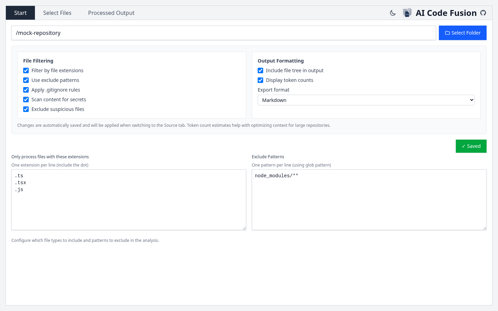
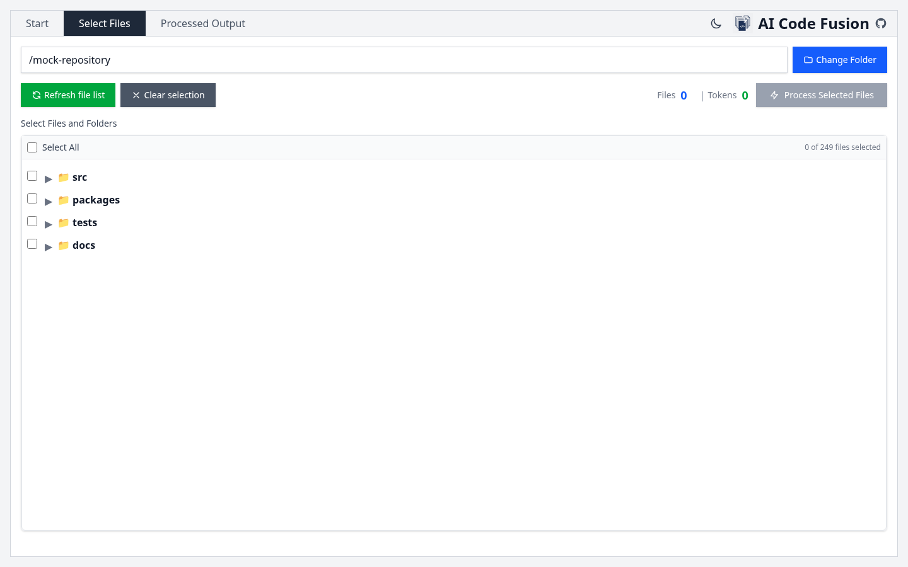
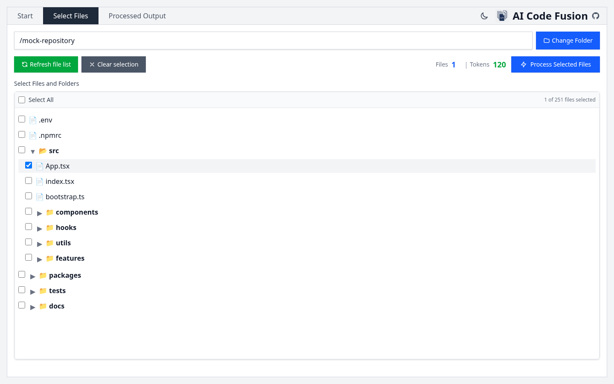
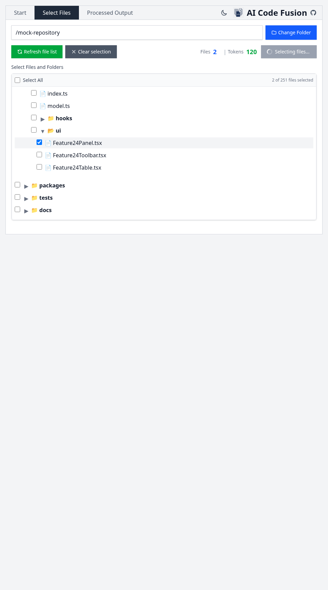
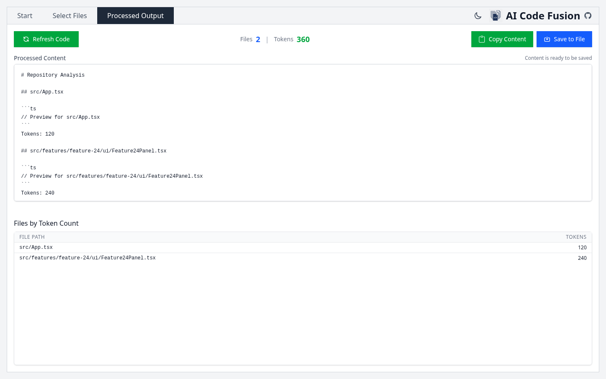

# App Views

This page shows up-to-date screenshots for the main app panels.

## Start Panel (Config)



## Select Files Panel



## Select Files Panel (With Selection)



## Select Files Panel (Resized)



## Processed Output Panel



## Refresh Screenshots

```bash
npm run docs:screenshots
```

This command runs the Playwright capture flow and updates screenshots in `docs/images/`.
